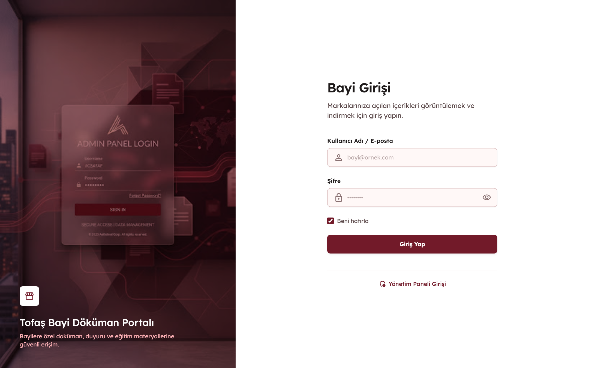
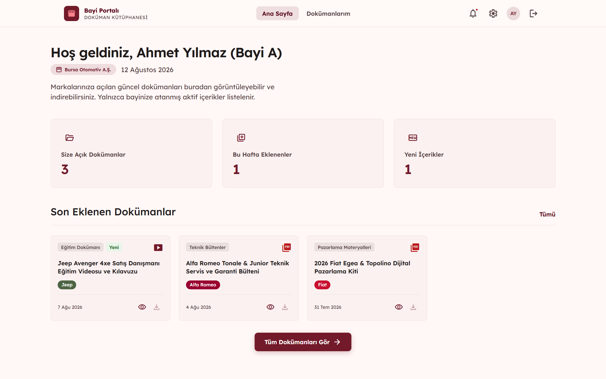
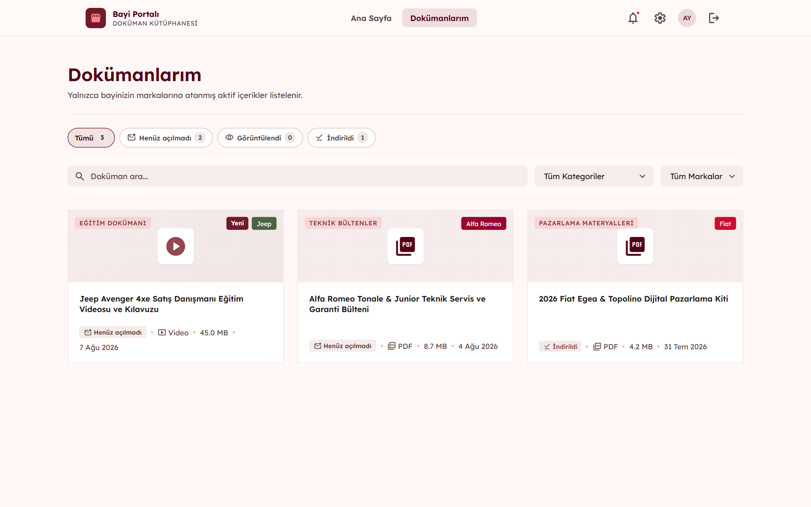
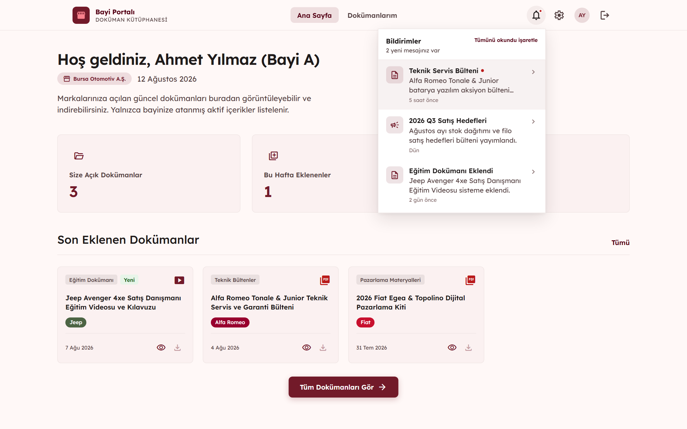
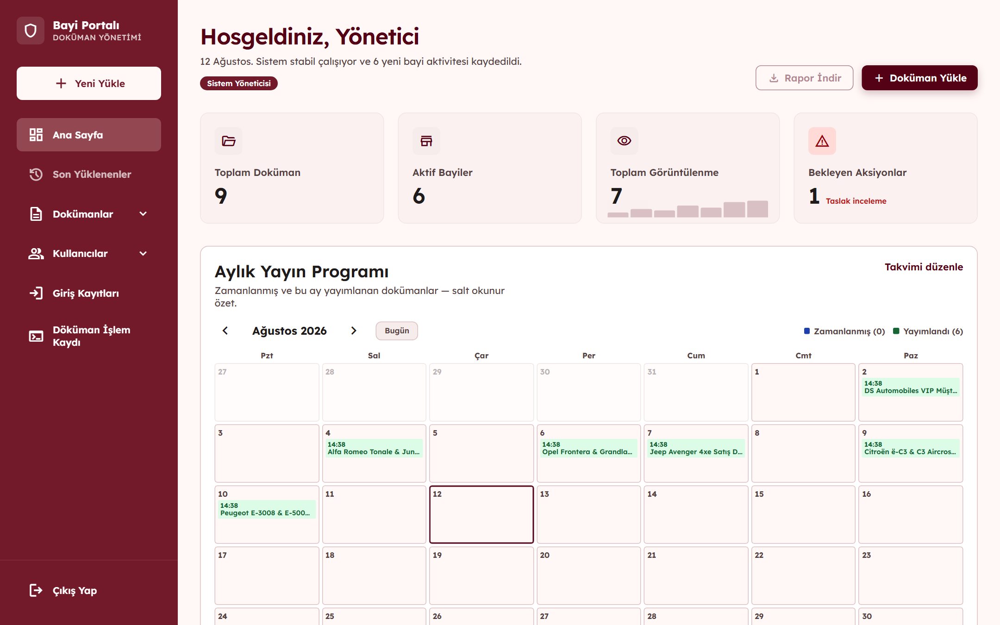
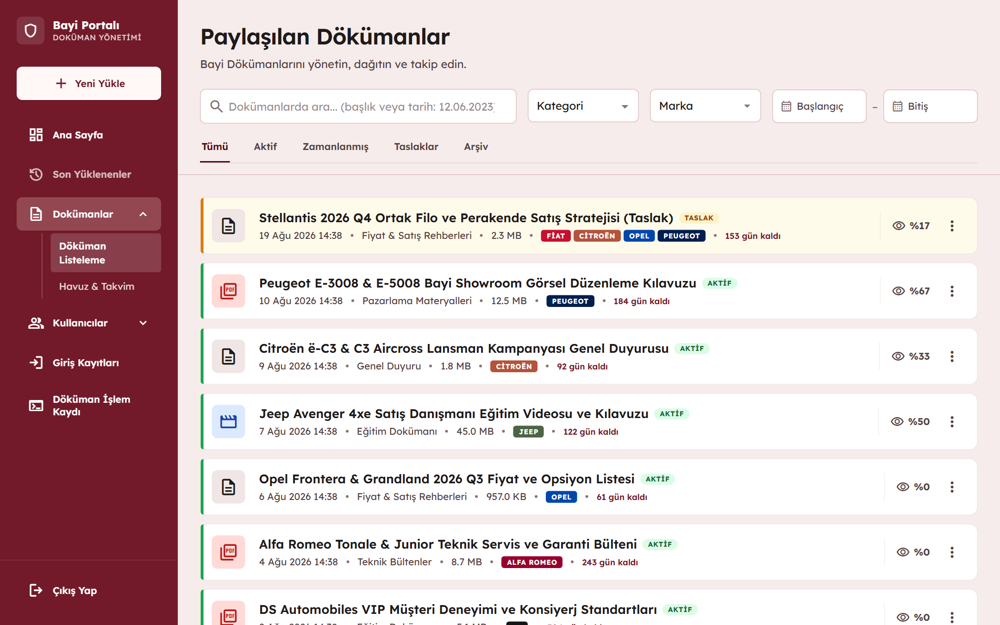

# 🏢 Enterprise Dealer Document Management Portal

> **Internship Project — Tofaş IT**

A web-based enterprise document management portal designed to provide authorized dealer users with centralized access to documents, announcements, training materials, and marketing content.

The platform includes role-based access control, brand-based content targeting, document lifecycle management, file handling, and access auditing.

---

## ⚠️ Confidentiality Notice

This project was developed during my software engineering internship at Tofaş.

Due to corporate confidentiality, intellectual property, and internal security requirements, the original source code, production data, internal URLs, credentials, and company-specific configuration are **not publicly available**.

This repository is a **sanitized portfolio presentation** of the project and contains only non-sensitive project information and selected interface screenshots.

No proprietary source code or confidential corporate data is included.

---

## 📌 Project Overview

The project addresses the need for a centralized platform through which authorized dealer users can access the documents and digital materials relevant to the brands they represent.

The system was designed around three primary user roles:

* **Administrator** — manages users, dealers, brands, categories, documents, and access records.
* **Content Manager** — creates, manages, publishes, and archives content.
* **Dealer User** — accesses documents and materials authorized for their dealer and associated brands.

The main workflow can be summarized as:

```text
Authentication
      ↓
Content Management
      ↓
Brand-Based Targeting
      ↓
Authorized Dealer Access
      ↓
Access Tracking & Auditing
```

---

# ✨ Key Features

### 🔐 Authentication & Authorization

* JWT-based authentication
* Role-based authorization
* Protected frontend routes
* Backend-side authorization enforcement
* Active/inactive user management

### 📄 Document Management

* Document upload and metadata management
* Document categorization
* Brand-based content targeting
* Document status management
* Archive / soft-delete workflow
* Controlled document download

### 🏷️ Brand-Based Access Control

A dealer does not automatically have access to every document in the system.

Content visibility is determined by the relationship between:

```text
Dealer
  ↓
Dealer ↔ Brand
  ↓
Authorized Brands
  ↓
Material ↔ Brand
  ↓
Visible Documents
```

This allows content to be distributed selectively according to the brands associated with a dealer.

### 📊 Access Auditing

The system records content access activities such as:

* Document viewing
* Document downloading
* User activity
* Access time
* Related document/user information

This provides an audit trail for content access and usage.

### 🗂️ Administrative Management

Administrators can manage:

* Users
* Dealers
* Brands
* Categories
* Documents
* Access records

---

# 🖥️ Application Preview

## Dealer Portal

### 🔐 Dealer Login

The dealer-facing application provides a dedicated authentication experience for authorized users.



---

### 🏠 Dealer Dashboard

After authentication, users are presented with a dashboard containing relevant information and recently added content.



---

### 📄 Document Library

Dealer users can browse available documents and filter content according to their needs.

Only content authorized for the user's dealer and associated brands is made available.



---

### 🔔 Notifications

The portal provides a notification interface for communicating relevant updates and announcements to users.



---

# 🛠️ Administration Portal

The project also includes a dedicated administration interface for managing the platform and monitoring content activity.

### 📊 Administration Dashboard

The dashboard provides administrators with an overview of system activity and content-related information.



---

### 📚 Document Management

Content managers and administrators can manage documents through a centralized interface.

Documents can be reviewed, filtered, managed, and targeted to specific brands.



---

### 📑 Document Details

Administrators can inspect document metadata and perform management operations through the document detail interface.


---

### 📊 Document Access Reporting

The system provides reporting capabilities for monitoring document access and understanding how content is being used.


---

## 🧩 Administration & Audit

The administration interface also includes dedicated management screens for users, dealers, brands, categories, login activity, and access logs.

These interfaces allow administrators to maintain the system's core definitions and monitor user activity.

---

# 🏗️ Architecture

The application was structured as a **modular monolith following Clean Architecture principles**.

The backend is intentionally separated into distinct responsibilities rather than placing business logic directly inside controllers.

```text
┌───────────────────────────────────────────┐
│                 Angular                   │
│                                           │
│  Pages • Components • Services            │
│  Route Guards • Interceptors              │
└─────────────────────┬─────────────────────┘
                      │
                 HTTPS / JWT
                      │
                      ▼
┌───────────────────────────────────────────┐
│            ASP.NET Core Web API            │
│                                           │
│  Controllers • Application Services       │
│  Authentication • Authorization           │
│  Swagger / OpenAPI                        │
└─────────────────────┬─────────────────────┘
                      │
                      ▼
┌───────────────────────────────────────────┐
│          Clean Architecture Layers        │
│                                           │
│  Core → Application → Infrastructure      │
└─────────────────────┬─────────────────────┘
                      │
              ┌───────┴────────┐
              ▼                ▼
       ┌─────────────┐  ┌───────────────┐
       │ PostgreSQL  │  │ File Storage  │
       │             │  │               │
       │ Metadata    │  │ Binary Files  │
       └─────────────┘  └───────────────┘
```

The project repository used a monorepo structure with the Angular frontend and ASP.NET Core backend maintained within the same repository.

---

# 🧱 Backend Architecture

The backend follows a layered Clean Architecture approach:

```text
Core
  │
  ├── Entities
  ├── Enums
  └── Domain Exceptions
       │
       ▼
Application
  │
  ├── Business Rules
  ├── DTOs
  ├── Validation
  └── Use Cases
       │
       ▼
Infrastructure
  │
  ├── EF Core
  ├── PostgreSQL
  ├── Repositories
  ├── Migrations
  └── File I/O
       │
       ▼
API
  │
  ├── Controllers
  ├── Middleware
  ├── JWT
  ├── Dependency Injection
  └── Swagger / OpenAPI
```

A key architectural principle was keeping controllers thin and moving business rules into the application layer. Data access and infrastructure concerns were isolated from business logic.

---

# 🌐 Frontend Architecture

The frontend was developed using Angular with a feature-oriented structure.

Main areas include:

```text
frontend
│
├── core
│   ├── guards
│   ├── interceptors
│   ├── services
│   └── models
│
├── features
│   ├── auth
│   ├── materials
│   └── admin
│
└── shared
    └── reusable components
```

Angular route guards are used to control the user experience and restrict access to role-specific pages, while authorization is ultimately enforced by the backend API.

---

# 🛠️ Technology Stack

### Frontend

* Angular
* TypeScript
* HTML
* SCSS

### Backend

* .NET 9
* ASP.NET Core Web API
* Entity Framework Core
* REST API

### Database

* PostgreSQL
* Npgsql
* Entity Framework Core Migrations

### Authentication & API

* JWT Authentication
* Role-Based Authorization
* Swagger / OpenAPI

### Infrastructure & Development

* Docker
* Docker Compose
* Git
* Figma

---

# 🗄️ Data Model

The system uses a relational data model to represent users, dealers, brands, categories, materials, and access records.

A simplified relationship model is:

```text
Users
  │
  ├──────────────► Dealers
  │                    │
  │                    ▼
  │              DealerBrands
  │                    │
  │                    ▼
  │                  Brands
  │                    ▲
  │                    │
  │              MaterialBrands
  │                    │
  │                    ▼
Categories ───────► Materials
                       │
                       ▼
                  AccessLogs
                       ▲
                       │
                     Users
```

One of the core authorization rules is based on the intersection between the brands associated with a dealer and the brands targeted by a document.

```text
DealerBrands ∩ MaterialBrands ≠ ∅
```

This relationship determines whether a dealer user can access a particular piece of content.

---

# 🔒 Security Considerations

Security was considered at multiple layers of the application.

### Authentication

Users authenticate through the backend API and receive a JWT used for subsequent authenticated requests.

### Authorization

Authorization is enforced on the backend rather than relying solely on frontend restrictions.

### DTO Usage

Internal fields such as password hashes and server-side file paths are not exposed directly through API responses.

### File Handling

Uploaded files are handled separately from database metadata. The database stores file-related metadata while the binary content is stored in configurable server-side storage.

### Access Logging

Document view and download operations can be recorded to provide an audit trail.

### Soft Delete

Archived content is removed from normal user-facing lists without physically deleting the underlying database record.

---

# 💻 My Contribution

During the project, I primarily focused on **backend development** while also contributing to the overall application development process.

My responsibilities included:

* Developing RESTful backend APIs
* Implementing business logic
* Working with Entity Framework Core
* Designing and configuring database relationships
* Implementing authentication and authorization
* Working with JWT-based authentication
* Developing role-based permission logic
* Implementing document upload/download workflows
* Working with PostgreSQL
* Implementing document access logging
* Testing APIs through Swagger and Postman
* Working with Docker and PostgreSQL
* Contributing to database and application architecture decisions
* Collaborating with the frontend development process

---

# 🧠 Engineering Challenges

## 1. Brand-Based Content Authorization

One of the main challenges was designing a permission model where a dealer could access only the content associated with the brands they were authorized to represent.

Instead of simply checking whether a user was authenticated, access decisions were made using the relationship between:

```text
User
  ↓
Dealer
  ↓
Dealer Brands
  ↓
Document Brands
```

This required authorization logic to be implemented at the application/backend level.

---

## 2. Secure File Management

Documents contain both business metadata and binary content.

The application therefore separates these concerns:

```text
PostgreSQL
    ↓
Document Metadata

File Storage
    ↓
Binary Content
```

This avoids exposing physical server paths through API responses and allows file storage to be configured independently from the relational database.

---

## 3. Role-Based Application Design

The application serves multiple types of users with significantly different responsibilities.

Rather than creating a single interface for everyone, the application provides role-specific experiences for:

```text
Administrator
      │
      ├── System Management
      ├── User Management
      ├── Content Management
      └── Audit / Reporting

Content Manager
      │
      ├── Content Creation
      ├── Publishing
      └── Archiving

Dealer User
      │
      ├── Content Discovery
      ├── Document Viewing
      └── Document Download
```

---

## 4. Auditability

Document access is not treated as a simple file download.

The system also considers **who accessed the content and what action was performed**, allowing administrators to review access activity.

This makes the application more suitable for an enterprise environment where content distribution needs to be traceable.

---

# 📚 What I Learned

This project was one of my first hands-on experiences with enterprise-oriented software development.

Through the project, I gained practical experience in:

* Clean Architecture
* Modular monolith design
* REST API development
* ASP.NET Core
* Entity Framework Core
* PostgreSQL
* Database relationship design
* JWT authentication
* Role-based authorization
* Angular
* Docker
* API testing
* File management
* Access logging
* Git-based team collaboration
* Translating business requirements into software features

More importantly, the project helped me understand that enterprise software development is not only about implementing features. Architecture, security, maintainability, authorization, data integrity, and auditability are equally important parts of the development process.

---

# 📈 Key Takeaways

The project gave me practical experience in designing and developing a full-stack enterprise application from both the **business requirement** and **software engineering** perspectives.

It also helped me understand how concepts such as:

```text
Clean Architecture
        +
Authentication
        +
Authorization
        +
Database Design
        +
File Management
        +
Audit Logging
```

come together to form a maintainable enterprise application.

---

## 📌 Project Information

|                         |                                               |
| ----------------------- | --------------------------------------------- |
| **Project Type**        | Enterprise Web Application                    |
| **Development Context** | Software Engineering Internship               |
| **Architecture**        | Modular Monolith + Clean Architecture         |
| **Frontend**            | Angular                                       |
| **Backend**             | ASP.NET Core / .NET 9                         |
| **Database**            | PostgreSQL                                    |
| **ORM**                 | Entity Framework Core                         |
| **Authentication**      | JWT                                           |
| **API Documentation**   | Swagger / OpenAPI                             |
| **Containerization**    | Docker / Docker Compose                       |
| **Source Code**         | Not publicly available due to confidentiality |

---

> **Note:** The screenshots and technical descriptions in this repository have been prepared for portfolio purposes and do not contain proprietary source code or confidential corporate data.
